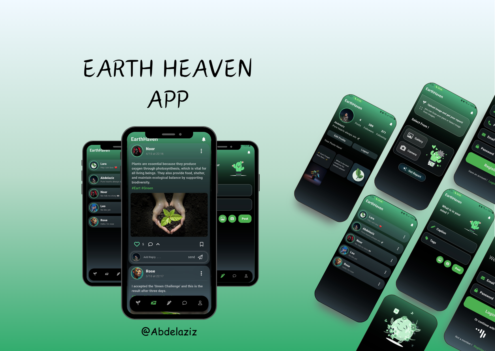

Earth Heaven
Protecting the environment and plant App - using “API & Firebase”
- Users can capture images of plants using the camera or pick from their gallery,
  and the AI will provide a report about the plant.
- They can also add posts with questions, images, and tags to the community.
- Users can react to posts and send replies.
- User can chat and send messages to each other.

